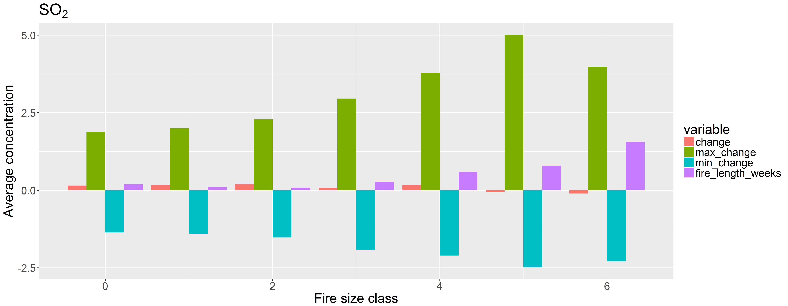

# Smoke Gets in Your Eyes: an Introduction to Data Science miniproject

## Introduction

This document describes the *Smoke Gets in Your Eyes* (SmoGYEye) tool, its intended uses, and potential use cases.

## What is SmoGYEye?

The SmoGYEye tool is a machine learning model that aims to predict how wildfires will impact the air quality in nearby communities. Given available data on a wildfire when it is initially detected – such as location, time, and cause of fire – the tool can be used to make a prediction of how severe the fire will be, and how much worse the air quality in the surrounding areas will be as a result from the smoke.

## Who is SmoGYEye for?

SmoGYEye is designed to help public authorities in assessing the potential health impacts of wildfire smoke in nearby communities. The predictions given by the tool can be used in forecasting the air quality in the vicinity of a wildfire, so that appropriate warnings can be issued to communities in affected areas. Smoke from wildfires is a potential health hazard, especially for sensitive groups such as children, the elderly, and individuals with chronic health conditions, and air quality forecasts can help both individuals and local authorities to take precautionary measures.

## How is SmoGYEye used?

The tool is currently at a proof-of-concept stage, and requires some expert knowledge to use. The trained machine learning model can be accessed using the Python programming language and freely available open source data science tools. The model can be deployed flexibly according to the using agency's needs: it can be attached to a standalone user interface or incorporated into an existing analysis model.

The scripts also provide a starting point for further analysis into combining wildfire data with air quality measurements. This also currently requires some expert knowledge. Here is an example plot of combined data:

## Data used in SmoGYEye

+ Data on wildfires in the US from https://www.kaggle.com/rtatman/188-million-us-wildfires
+ Data on air quality from https://aqs.epa.gov/aqsweb/airdata/download_files.html
